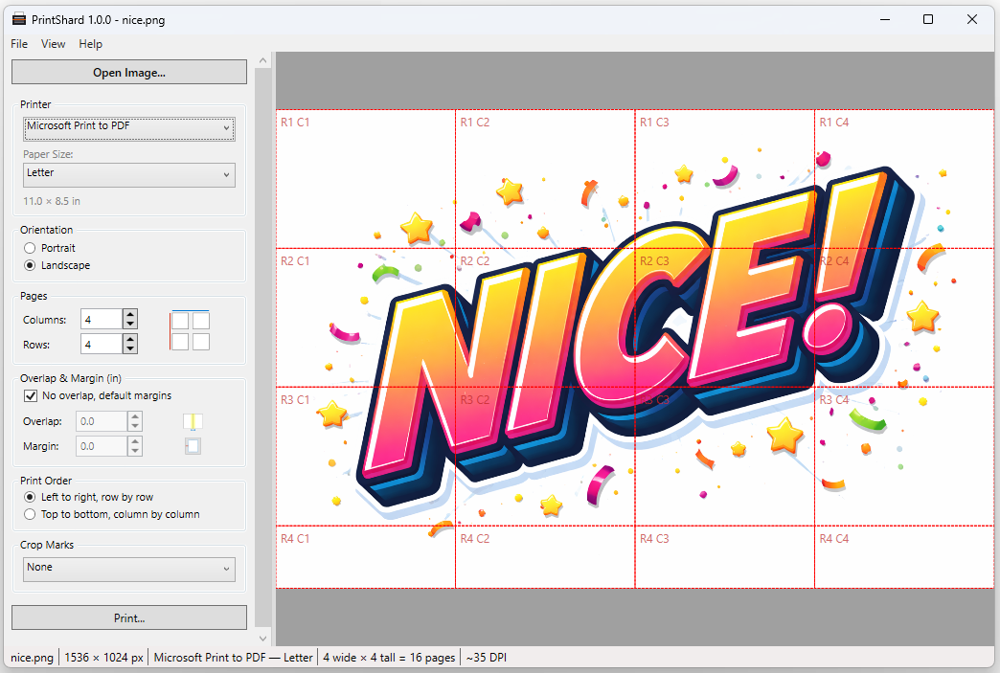

# PrintShard

PrintShard is a Windows desktop application for tiling large images across multiple printed pages, letting you produce large-format prints on any standard printer.

Load an image, configure how many pages wide and tall you want, and PrintShard splits the image into tiles — each sized to fit one sheet of paper — with optional overlap, margins, and crop marks to make assembly easy.

---



---

## Features

- **Tile any image** across any grid of pages (columns × rows)
- **Portrait and landscape** orientation support
- **Overlap** between adjacent tiles so you can align and trim them accurately
- **User-defined margins** or automatic minimum-margin detection from the printer
- **Crop marks** at tile boundaries — None, Corners, or Full Lines
- **Print order** — Left-to-right then down, or top-to-bottom then right
- **Print preview** — inspect every page before sending to the printer
- **Live preview canvas** with zoom and pan; page borders overlaid on the image
- **Drag-and-drop** image loading
- **Recent files** list (last 10 files)
- Measurement units follow the system locale (mm or inches)
- Supports JPEG, PNG, BMP, GIF, TIFF, WEBP, ICO, and any RAW format with a WIC codec installed

---

## Requirements

| Requirement | Version |
|---|---|
| Windows | 10 or 11 (x64) |
| .NET SDK (to build) | 9.0 or later |
| .NET Runtime (to run) | 9.0 or later (Windows Desktop Runtime) |

No external NuGet packages are required.

---

## Building

### Using Visual Studio

1. Open `PrintShard.sln` in Visual Studio 2022 or later.
2. Select the **Release | x64** configuration.
3. Build → Build Solution (`Ctrl+Shift+B`).
4. The executable is output to `PrintShard\bin\x64\Release\net9.0-windows\PrintShard.exe`.

### Using the .NET CLI

```bash
dotnet build PrintShard.sln -c Release -r win-x64
```

Or to produce a self-contained single-file executable:

```bash
dotnet publish PrintShard/PrintShard.csproj \
  -c Release \
  -r win-x64 \
  --self-contained true \
  -p:PublishSingleFile=true \
  -o publish/
```

### Running Tests

```bash
dotnet test PrintShard.Tests/PrintShard.Tests.csproj
```

---

## Usage

1. **Open an image** via File → Open, or drag-and-drop a file onto the window.
2. **Select your printer** and **paper size** from the dropdowns in the left panel.
3. Set the number of **columns** (pages wide) and **rows** (pages tall).
4. Adjust **overlap** and **margin** as needed, or leave "No overlap, default margins" checked to use printer defaults.
5. Choose a **crop mark** style to help with alignment when assembling the final print.
6. Click **Print...** to open the print preview.
7. In the preview, page through the tiles to verify the layout, then click **Print...** to send to the printer.

---

## Project Structure

```
PrintShard/
├── PrintShard.sln              Solution file
├── SPEC.md                     Full application specification
├── README.md                   This file
├── PrintShard/                 Main WPF application
│   ├── PrintShard.csproj
│   ├── Assets/                 Icons and XAML resource dictionaries
│   ├── Controls/               Custom controls (NumericSpinner, ImagePreviewCanvas)
│   ├── Converters/             XAML value converters
│   ├── Models/                 Data models (TileLayout, PaperSize, CropMarkStyle, …)
│   ├── Services/               Business logic (PrintService, ImageLoaderService, …)
│   ├── ViewModels/             MVVM view models
│   └── Views/                  XAML windows (PrintPreviewWindow)
└── PrintShard.Tests/           Unit tests (MSTest)
```

---

## License

This project is provided as-is for personal and internal use.
